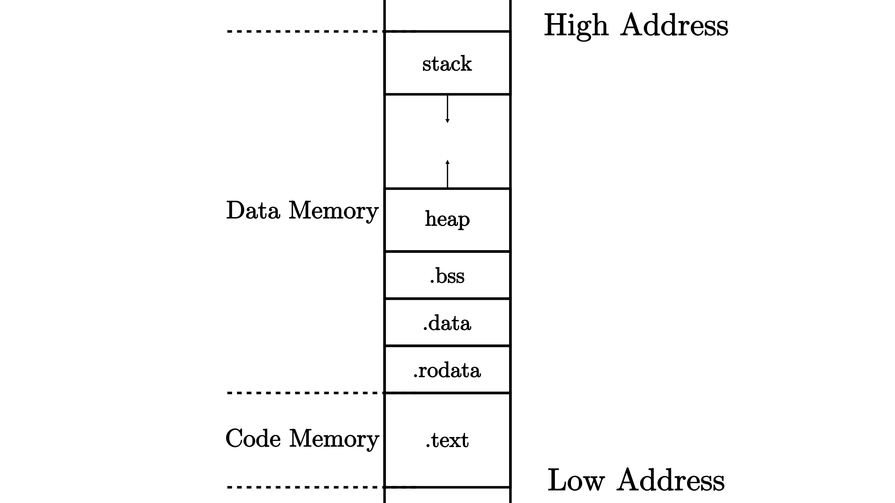

# Lab 2 编写操作系统内核前置知识

## 本节导读

Lab 2 我们将进行构建操作系统内核的第二步，即将我们的内核正确对接到 Qemu 模拟器上，使得 Qemu 模拟器可以成功执行内核的第一条指令。本节我们将介绍一些相关基础知识。首先介绍计算机的各个硬件组成部分，特别是 CPU 和物理内存；其次介绍 Qemu 模拟器的抽象模型、使用方法以及启动流程，作为补充我们还介绍了一般计算机的启动流程；最后我们介绍程序内存布局和编译流程，特别是链接的相关知识。这些理论知识可以帮助我们更好的理解下一节的实践操作背后的动机和目的。

## 计算机组成基础

当编写应用程序的时候，大多数情况下我们只需调用库函数即可在操作系统的支持下实现各项功能，而无需关心操作系统如何调度管理各类软硬件资源。操作系统提供了一些监控工具（如 Windows 上的任务管理器或 Linux 上的 `ps` 工具），这些工具可以帮助我们统计 CPU、内存、硬盘、网络等资源的占用情况，从而让我们大致上了解这些资源的使用情况，并帮助我们更好地开发或部署应用程序。然而，在实际编写操作系统的时候，我们就必须直面这些硬件资源，将它们管理起来并为应用程序提供高效易用的抽象。为此，我们必须增进对于这些硬件的了解。

计算机主要由处理器（Processor，也即中央处理器，CPU，Central Processing Unit），物理内存和 I/O 外设三部分组成。在前八章我们主要用到 CPU 和物理内存。处理器的主要功能是从物理内存中读取指令、译码并执行，在此过程中还要与物理内存和 I/O 外设打交道。物理内存则是计算机体系结构中一个重要的组成部分。在存储方面，CPU 唯一能够直接访问的只有物理内存中的数据，它可以通过访存指令来达到这一目的。从 CPU 的视角看来，可以将物理内存看成一个大字节数组，而物理地址则对应于一个能够用来访问数组中某个元素的下标。与我们日常编程习惯不同的是，该下标通常不以 0 开头，而通常以一个常数，如 `0x80000000` 开头。简言之，CPU 可以通过物理地址来寻址，并 **逐字节** 地访问物理内存中保存的数据。

## 了解 Qemu 模拟器

我们编写的内核将主要在 Qemu 模拟器上运行来检验其正确性。这样做主要是为了方便快捷，只需在命令行输入一行命令即可让内核跑起来。为了让我们的内核能够正确对接到 Qemu 模拟器上，我们首先要对 Qemu 模拟器有一定的了解。在本书中，我们使用软件 `qemu-system-riscv64` 来模拟一台 64 位 RISC-V 架构的计算机，它包含一个 CPU 、一条物理内存以及若干 I/O 外设。它的具体配置（比如 CPU 的核数或是物理内存的大小）均可由用户自由调整。作为模拟器，在宿主机看来它只是一个用户程序，因此上面提到的资源都是它利用宿主机（即 Qemu 运行所在的平台，如 Linux/Windows/macOS）提供给它的资源模拟出来的。取决于模拟的方式不同，在 Qemu 上有些模拟出来的资源性能很高，甚至接近宿主机上原生资源的性能；而另一些资源在模拟过程中的开销较大，于是它的性能相较原生资源的退化较为严重。

接下来我们来看如何启动 Qemu 。首先从 Github 下载课程代码：

```shell
git clone https://github.com/bjtu-os/labs.git
```

进入项目

```shell
cd labs
```

我们使用如下命令来启动 Qemu 并运行我们的内核：

```shell
qemu-system-riscv64 \
    -machine virt \
    -nographic \
    -bios env/bootloader/rustsbi-qemu.bin \
    -device loader,file=env/os.bin,addr=0x80200000
```

其中：

- `-machine virt` 表示将模拟的 64 位 RISC-V 计算机设置为名为 `virt` 的虚拟计算机。我们知道，即使同属同一种指令集架构，也会有很多种不同的计算机配置，比如 CPU 的生产厂商和型号不同，支持的 I/O 外设种类也不同。
- `-nographic` 表示模拟器不需要提供图形界面，而只需要对外输出字符流。
- 通过 `-bios` 可以设置 Qemu 模拟器开机时用来初始化的引导加载程序（bootloader），这里我们使用预编译好的 `rustsbi-qemu.bin` 。
- 通过虚拟设备 `-device` 中的 `loader` 属性可以在 Qemu 模拟器开机之前将一个宿主机上的文件载入到 Qemu 的物理内存的指定位置中， `file` 和 `addr` 属性分别可以设置待载入文件的路径以及将文件载入到的 Qemu 物理内存上的物理地址。注意这里我们载入的文件带有 `.bin` 后缀，它并不是上一节中我们移除标准库依赖后构建得到的内核可执行文件，而是还要进行加工处理得到内核镜像。我们后面再进行深入讨论。

## Qemu 启动流程

`virt` 平台上，物理内存的起始物理地址为 `0x80000000` ，物理内存的默认大小为 128MiB ，它可以通过 `-m` 选项进行配置。在本书中，我们只会用到最低的 8MiB 物理内存，对应的物理地址区间为 `[0x80000000,0x80800000)` 。如果使用上面给出的命令启动 Qemu ，那么在 Qemu 开始执行任何指令之前，首先两个文件将被加载到 Qemu 的物理内存中：即作为 bootloader 的 `rustsbi-qemu.bin` 被加载到物理内存以物理地址 `0x80000000` 开头的区域上，同时内核镜像 `os.bin` 被加载到以物理地址 `0x80200000` 开头的区域上。

为什么加载到这两个位置呢？这与 Qemu 模拟计算机加电启动后的运行流程有关。一般来说，计算机加电之后的启动流程可以分成若干个阶段，每个阶段均由一层软件负责，每一层软件的功能是进行它应当承担的初始化工作，并在此之后跳转到下一层软件的入口地址，也就是将计算机的控制权移交给了下一层软件。Qemu 模拟的启动流程则可以分为三个阶段：第一个阶段由固化在 Qemu 内的一小段汇编程序负责；第二个阶段由 bootloader 负责；第三个阶段则由内核镜像负责。

- 第一阶段：将必要的文件载入到 Qemu 物理内存之后，Qemu CPU 的程序计数器（PC, Program Counter）会被初始化为 `0x1000` ，因此 Qemu 实际执行的第一条指令位于物理地址 `0x1000` ，接下来它将执行寥寥数条指令并跳转到物理地址 `0x80000000` 对应的指令处并进入第二阶段。从后面的调试过程可以看出，该地址 `0x80000000` 被固化在 Qemu 中，作为 Qemu 的使用者，我们在不触及 Qemu 源代码的情况下无法进行更改。
- 第二阶段：由于 Qemu 的第一阶段固定跳转到 `0x80000000` ，我们需要将负责第二阶段的 bootloader `rustsbi-qemu.bin` 放在以物理地址 `0x80000000` 开头的物理内存中，这样就能保证 `0x80000000` 处正好保存 bootloader 的第一条指令。在这一阶段，bootloader 负责对计算机进行一些初始化工作，并跳转到下一阶段软件的入口，在 Qemu 上即可实现将计算机控制权移交给我们的内核镜像 `os.bin` 。这里需要注意的是，对于不同的 bootloader 而言，下一阶段软件的入口不一定相同，而且获取这一信息的方式和时间点也不同：入口地址可能是一个预先约定好的固定的值，也有可能是在 bootloader 运行期间才动态获取到的值。我们选用的 RustSBI 则是将下一阶段的入口地址预先约定为固定的 `0x80200000` ，在 RustSBI 的初始化工作完成之后，它会跳转到该地址并将计算机控制权移交给下一阶段的软件——也即我们的内核镜像。
- 第三阶段：为了正确地和上一阶段的 RustSBI 对接，我们需要保证内核的第一条指令位于物理地址 `0x80200000` 处。为此，我们需要将内核镜像预先加载到 Qemu 物理内存以地址 `0x80200000` 开头的区域上。一旦 CPU 开始执行内核的第一条指令，证明计算机的控制权已经被移交给我们的内核，也就达到了本节的目标。

> **真实计算机的加电启动流程**
>
> 真实计算机的启动流程大致上也可以分为三个阶段：
>
> - 第一阶段：加电后 CPU 的 PC 寄存器被设置为计算机内部只读存储器（ROM，Read-only Memory）的物理地址，随后 CPU 开始运行 ROM 内的软件。我们一般将该软件称为固件（Firmware），它的功能是对 CPU 进行一些初始化操作，将后续阶段的 bootloader 的代码、数据从硬盘载入到物理内存，最后跳转到适当的地址将计算机控制权转移给 bootloader 。它大致对应于 Qemu 启动的第一阶段，即在物理地址 `0x1000` 处放置的若干条指令。可以看到 Qemu 上的固件非常简单，因为它并不需要负责将 bootloader 从硬盘加载到物理内存中，这个任务此前已经由 Qemu 自身完成了。
> - 第二阶段：bootloader 同样完成一些 CPU 的初始化工作，将操作系统镜像从硬盘加载到物理内存中，最后跳转到适当地址将控制权转移给操作系统。可以看到一般情况下 bootloader 需要完成一些数据加载工作，这也就是它名字中 loader 的来源。它对应于 Qemu 启动的第二阶段。在 Qemu 中，我们使用的 RustSBI 功能较弱，它并没有能力完成加载的工作，内核镜像实际上是和 bootloader 一起在 Qemu 启动之前加载到物理内存中的。
> - 第三阶段：控制权被转移给操作系统。由于篇幅所限后面我们就不再赘述了。
>
> 值得一提的是，为了让计算机的启动更加灵活，bootloader 目前可能非常复杂：它可能也分为多个阶段，并且能管理一些硬件资源，从复杂性上它已接近一个传统意义上的操作系统。

基于上面对 Qemu 启动流程的介绍，我们可以知道为了让我们的内核镜像能够正确对接到 Qemu 和 RustSBI 上，我们提交给 Qemu 的内核镜像文件必须满足：该文件的开头即为内核待执行的第一条指令。但后面会讲到，在上一节中我们通过移除标准库依赖得到的可执行文件实际上并不满足该条件。因此，我们还需要对可执行文件进行一些操作才能得到可提交给 Qemu 的内核镜像。为了说明这些条件，首先我们需要了解一些关于程序内存布局和编译流程的知识。

## 程序内存布局与编译流程

### 程序内存布局

在我们将源代码编译为可执行文件之后，它就会变成一个看似充满了杂乱无章的字节的一个文件。但我们知道这些字节至少可以分成代码和数据两部分，在程序运行起来的时候它们的功能并不相同：代码部分由一条条可以被 CPU 解码并执行的指令组成，而数据部分只是被 CPU 视作可读写的内存空间。事实上我们还可以根据其功能进一步把两个部分划分为更小的单位：**段** (Section) 。不同的段会被编译器放置在内存不同的位置上，这构成了程序的 **内存布局** (Memory Layout)。一种典型的程序相对内存布局如下所示：



在上图中可以看到，代码部分只有代码段 `.text` 一个段，存放程序的所有汇编代码。而数据部分则还可以继续细化：

- 已初始化数据段保存程序中那些已初始化的全局数据，分为 `.rodata` 和 `.data` 两部分。前者存放只读的全局数据，通常是一些常数或者是 常量字符串等；而后者存放可修改的全局数据。
- 未初始化数据段 `.bss` 保存程序中那些未初始化的全局数据，通常由程序的加载者代为进行零初始化，即将这块区域逐字节清零；
- **堆** （heap）区域用来存放程序运行时动态分配的数据，如 C/C++ 中的 malloc/new 分配到的数据本体就放在堆区域，它向高地址增长；
- **栈** （stack）区域不仅用作函数调用上下文的保存与恢复，每个函数作用域内的局部变量也被编译器放在它的栈帧内，它向低地址增长。

### 编译流程

从源代码得到可执行文件的编译流程可被细化为多个阶段（虽然输入一条命令便可将它们全部完成）：

1. **编译器** (Compiler) 将每个源文件从某门高级编程语言转化为汇编语言，注意此时源文件仍然是一个 ASCII 或其他编码的文本文件；
2. **汇编器** (Assembler) 将上一步的每个源文件中的文本格式的指令转化为机器码，得到一个二进制的 **目标文件** (Object File)；
3. **链接器** (Linker) 将上一步得到的所有目标文件以及一些可能的外部目标文件链接在一起形成一个完整的可执行文件。

汇编器输出的每个目标文件都有一个独立的程序内存布局，它描述了目标文件内各段所在的位置。而链接器所做的事情是将所有输入的目标文件整合成一个整体的内存布局。在此期间链接器主要完成两件事情：

- 第一件事情是将来自不同目标文件的段在目标内存布局中重新排布。如下图所示，在链接过程中，分别来自于目标文件 `1.o` 和 `2.o` 段被按照段的功能进行分类，相同功能的段被排在一起放在拼装后的目标文件 `output.o` 中。注意到，目标文件 `1.o` 和 `2.o` 的内存布局是存在冲突的，同一个地址在不同的内存布局中存放不同的内容。而在合并后的内存布局中，这些冲突被消除。


- 第二件事情是将符号替换为具体地址。这里的符号指什么呢？我们知道，在我们进行模块化编程的时候，每个模块都会提供一些向其他模块公开的全局变量、函数等供其他模块访问，也会访问其他模块向它公开的内容。要访问一个变量或者调用一个函数，在源代码级别我们只需知道它们的名字即可，这些名字被我们称为符号。取决于符号来自于模块内部还是其他模块，我们还可以进一步将符号分成内部符号和外部符号。然而，在机器码级别（也即在目标文件或可执行文件中）我们并不是通过符号来找到索引我们想要访问的变量或函数，而是直接通过变量或函数的地址。例如，如果想调用一个函数，那么在指令的机器码中我们可以找到函数入口的绝对地址或者相对于当前 PC 的相对地址。

  那么，符号何时被替换为具体地址呢？因为符号对应的变量或函数都是放在某个段里面的固定位置（如全局变量往往放在 `.bss` 或者 `.data` 段中，而函数则放在 `.text` 段中），所以我们需要等待符号所在的段确定了它们在内存布局中的位置之后才能知道它们确切的地址。当一个模块被转化为目标文件之后，它的内部符号就已经在目标文件中被转化为具体的地址了，因为目标文件给出了模块的内存布局，也就意味着模块内的各个段的位置已经被确定了。然而，此时模块所用到的外部符号的地址无法确定。我们需要将这些外部符号记录下来，放在目标文件一个名为符号表（Symbol table）的区域内。由于后续可能还需要重定位，内部符号也同样需要被记录在符号表中。

  外部符号需要等到链接的时候才能被转化为具体地址。假设模块 1 用到了模块 2 提供的内容，当两个模块的目标文件链接到一起的时候，它们的内存布局会被合并，也就意味着两个模块的各个段的位置均被确定下来。此时，模块 1 用到的来自模块 2 的外部符号可以被转化为具体地址。同时我们还需要注意：两个模块的段在合并后的内存布局中被重新排布，其最终的位置有可能和它们在模块自身的局部内存布局中的位置相比已经发生了变化。因此，每个模块的内部符号的地址也有可能会发生变化，我们也需要进行修正。上面的过程被称为重定位（Relocation），这个过程形象一些来说很像拼图：由于模块 1 用到了模块 2 的内容，因此二者分别相当于一块凹进和凸出一部分的拼图，正因如此我们可以将它们无缝地拼接到一起。

上面我们简单介绍了程序内存布局和编译流程特别是链接过程的相关知识。那么如何得到一个能够在 Qemu 上成功运行的内核镜像呢？首先我们需要通过链接脚本调整内核可执行文件的内存布局，使得内核被执行的第一条指令位于地址 `0x80200000` 处，同时代码段所在的地址应低于其他段。这是因为 Qemu 物理内存中低于 `0x80200000` 的区域并未分配给内核，而是主要由 RustSBI 使用。其次，我们需要将内核可执行文件中的元数据丢掉得到内核镜像，此内核镜像仅包含实际会用到的代码和数据。这则是因为 Qemu 的加载功能过于简单直接，它直接将输入的文件逐字节拷贝到物理内存中，因此也可以说这一步是我们在帮助 Qemu 手动将可执行文件加载到物理内存中。[下一节](./kernel.md) 我们将成功生成内核镜像并在 Qemu 上验证控制权被转移到内核。
