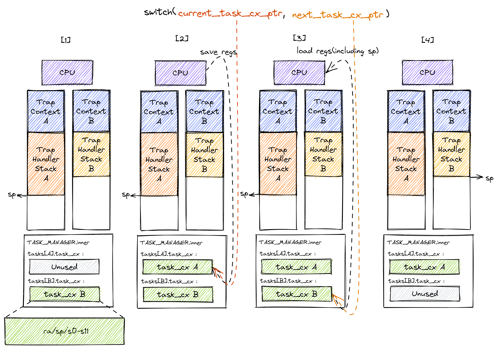

# 任务切换

## 本节导读

在上一节实现的操作系统还是比较原始，一个应用会独占 CPU 直到它出错或主动退出。操作系统还是以程序的一次执行过程（从开始到结束）作为处理器切换程序的时间段。为了提高效率，我们需要引入新的操作系统概念 **任务** 、 **任务切换** 、**任务上下文** 。

如果把应用程序执行的整个过程进行进一步分析，可以看到，当程序访问 I/O 外设或睡眠时，其实是不需要占用处理器的，于是我们可以把应用程序在不同时间段的执行过程分为两类，占用处理器执行有效任务的计算阶段和不必占用处理器的等待阶段。这些阶段就形成了一个我们熟悉的 “暂停 - 继续 …” 组合的控制流或执行历史。从应用程序开始执行到结束的整个控制流就是应用程序的整个执行过程。

本节的重点是操作系统的核心机制 —— **任务切换** 。 任务切换支持的场景是：一个应用在运行途中便会主动或被动交出 CPU 的使用权，此时它只能暂停执行，等到内核重新给它分配处理器资源之后才能恢复并继续执行。

## 任务的概念形成

如果操作系统能够在某个应用程序处于等待阶段的时候，把处理器转给另外一个处于计算阶段的应用程序，那么只要转换的开销不大，那么处理器的执行效率就会大大提高。当然，这需要应用程序在运行途中能主动交出 CPU 的使用权，此时它处于等待阶段，等到操作系统让它再次执行后，那它就可以继续执行了。

到这里，我们就把应用程序的一次执行过程（也是一段控制流）称为一个 **任务** ，把应用执行过程中的一个时间片段上的执行片段或空闲片段称为 “ **计算任务片** ” 或“ **空闲任务片** ” 。当应用程序的所有任务片都完成后，应用程序的一次任务也就完成了。从一个程序的任务切换到另外一个程序的任务称为 **任务切换** 。为了确保切换后的任务能够正确继续执行，操作系统需要支持让任务的执行“暂停”和“继续”。

我们又看到了熟悉的“暂停-继续”组合。一旦一条控制流需要支持“暂停-继续”，就需要提供一种控制流切换的机制，而且需要保证程序执行的控制流被切换出去之前和切换回来之后，能够继续正确执行。这需要让程序执行的状态（也称上下文），即在执行过程中同步变化的资源（如寄存器、栈等）保持不变，或者变化在它的预期之内。不是所有的资源都需要被保存，事实上只有那些对于程序接下来的正确执行仍然有用，且在它被切换出去的时候有被覆盖风险的那些资源才有被保存的价值。这些需要保存与恢复的资源被称为 **任务上下文 (Task Context)** 。

## 任务切换的设计与实现

本节所讲的任务切换是第二章提及的 Trap 控制流切换之外的另一种异常控制流，都是描述两条控制流之间的切换，如果将它和 Trap 切换进行比较，会有如下异同：

- 与 Trap 切换不同，它不涉及特权级切换；
- 与 Trap 切换不同，它的一部分是由编译器帮忙完成的；
- 与 Trap 切换相同，它对应用是透明的。

事实上，任务切换是来自两个不同应用在内核中的 Trap 控制流之间的切换。当一个应用 Trap 到 S 模式的操作系统内核中进行进一步处理（即进入了操作系统的 Trap 控制流）的时候，其 Trap 控制流可以调用一个特殊的 `__switch` 函数。这个函数表面上就是一个普通的函数调用：在 `__switch` 返回之后，将继续从调用该函数的位置继续向下执行。但是其间却隐藏着复杂的控制流切换过程。具体来说，调用 `__switch` 之后直到它返回前的这段时间，原 Trap 控制流 *A* 会先被暂停并被切换出去， CPU 转而运行另一个应用在内核中的 Trap 控制流 *B* 。然后在某个合适的时机，原 Trap 控制流 *A* 才会从某一条 Trap 控制流 *C* （很有可能不是它之前切换到的 *B* ）切换回来继续执行并最终返回。不过，从实现的角度讲， `__switch` 函数和一个普通的函数之间的核心差别仅仅是它会 **换栈** 。


当 Trap 控制流准备调用 `__switch` 函数使任务从运行状态进入暂停状态的时候，让我们考察一下它内核栈上的情况。如上图左侧所示，在准备调用 `__switch` 函数之前，内核栈上从栈底到栈顶分别是保存了应用执行状态的 Trap 上下文以及内核在对 Trap 处理的过程中留下的调用栈信息。由于之后还要恢复回来执行，我们必须保存 CPU 当前的某些寄存器，我们称它们为 **任务上下文** (Task Context)。我们会在稍后介绍里面需要包含哪些寄存器。至于上下文保存的位置，下一节在我们会介绍任务管理器 `TaskManager` ，在里面能找到一个数组 `tasks` ，其中的每一项都是一个任务控制块即 `TaskControlBlock` ，它负责保存一个任务的状态，而任务上下文 `TaskContext` 被保存在任务控制块中。在内核运行时我们会初始化 `TaskManager` 的全局实例 `TASK_MANAGER` ，因此所有任务上下文实际保存在在 `TASK_MANAGER` 中，从内存布局来看则是放在内核的全局数据 `.data` 段中。当我们将任务上下文保存完毕之后则转化为下图右侧的状态。当要从其他任务切换回来继续执行这个任务的时候，CPU 会读取同样的位置并从中恢复任务上下文。

对于当前正在执行的任务的 Trap 控制流，我们用一个名为 `current_task_cx_ptr` 的变量来保存放置当前任务上下文的地址；而用 `next_task_cx_ptr` 的变量来保存放置下一个要执行任务的上下文的地址。利用 C 语言的引用来描述的话就是：

```c
TaskContext *current_task_cx_ptr = &tasks[current].task_cx;
TaskContext *next_task_cx_ptr    = &tasks[next].task_cx;
```

接下来我们同样从栈上内容的角度来看 `__switch` 的整体流程：



Trap 控制流在调用 `__switch` 之前就需要明确知道即将切换到哪一条目前正处于暂停状态的 Trap 控制流，因此 `__switch` 有两个参数，第一个参数代表它自己，第二个参数则代表即将切换到的那条 Trap 控制流。这里我们用上面提到过的 `current_task_cx_ptr` 和 `next_task_cx_ptr` 作为代表。在上图中我们假设某次 `__switch` 调用要从 Trap 控制流 A 切换到 B，一共可以分为四个阶段，在每个阶段中我们都给出了 A 和 B 内核栈上的内容。

- 阶段 [1]：在 Trap 控制流 A 调用 `__switch` 之前，A 的内核栈上只有 Trap 上下文和 Trap 处理函数的调用栈信息，而 B 是之前被切换出去的；
- 阶段 [2]：A 在 A 任务上下文空间在里面保存 CPU 当前的寄存器快照；
- 阶段 [3]：这一步极为关键，读取 `next_task_cx_ptr` 指向的 B 任务上下文，根据 B 任务上下文保存的内容来恢复 `ra` 寄存器、`s0~s11` 寄存器以及 `sp` 寄存器。只有这一步做完后， `__switch` 才能做到一个函数跨两条控制流执行，即 *通过换栈也就实现了控制流的切换* 。
- 阶段 [4]：上一步寄存器恢复完成后，可以看到通过恢复 `sp` 寄存器换到了任务 B 的内核栈上，进而实现了控制流的切换。这就是为什么 `__switch` 能做到一个函数跨两条控制流执行。此后，当 CPU 执行 `ret` 汇编伪指令完成 `__switch` 函数返回后，任务 B 可以从调用 `__switch` 的位置继续向下执行。

从结果来看，我们看到 A 控制流 和 B 控制流的状态发生了互换， A 在保存任务上下文之后进入暂停状态，而 B 则恢复了上下文并在 CPU 上继续执行。

下面我们给出 `__switch` 的实现：

```assembly
# os/src/task/switch.S

.altmacro
.macro SAVE_SN n
    sd s\n, (\n+2)*8(a0)
.endm
.macro LOAD_SN n
    ld s\n, (\n+2)*8(a1)
.endm
    .section .text
    .globl __switch
__switch:
    # 阶段 [1]
    # __switch(
    #     current_task_cx_ptr: *mut TaskContext,
    #     next_task_cx_ptr: *const TaskContext
    # )
    # 阶段 [2]
    # save kernel stack of current task
    sd sp, 8(a0)
    # save ra & s0~s11 of current execution
    sd ra, 0(a0)
    .set n, 0
    .rept 12
        SAVE_SN %n
        .set n, n + 1
    .endr
    # 阶段 [3]
    # restore ra & s0~s11 of next execution
    ld ra, 0(a1)
    .set n, 0
    .rept 12
        LOAD_SN %n
        .set n, n + 1
    .endr
    # restore kernel stack of next task
    ld sp, 8(a1)
    # 阶段 [4]
    ret
```

我们手写汇编代码来实现 `__switch` 。在阶段 [1] 可以看到它的函数原型中的两个参数分别是当前 A 任务上下文指针 `current_task_cx_ptr` 和即将被切换到的 B 任务上下文指针 `next_task_cx_ptr` ，从 [RISC-V 调用规范](../lab2/func-call.md#调用规范) 可以知道它们分别通过寄存器 `a0/a1` 传入。阶段 [2] 体现在第 19~27 行，即根据 B 任务上下文保存的内容来恢复 `ra` 寄存器、`s0~s11` 寄存器以及 `sp` 寄存器。从中我们也能够看出 `TaskContext` 里面究竟包含哪些寄存器：

